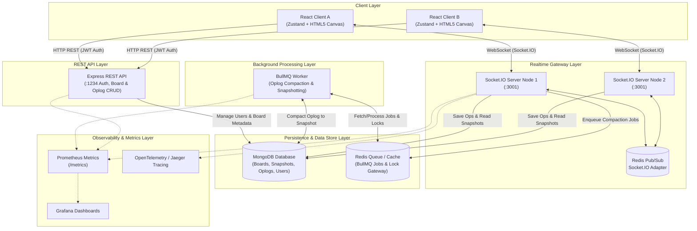
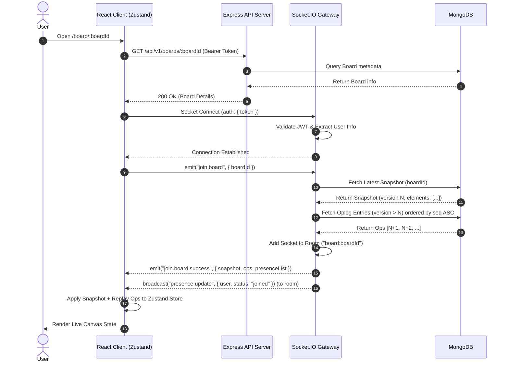
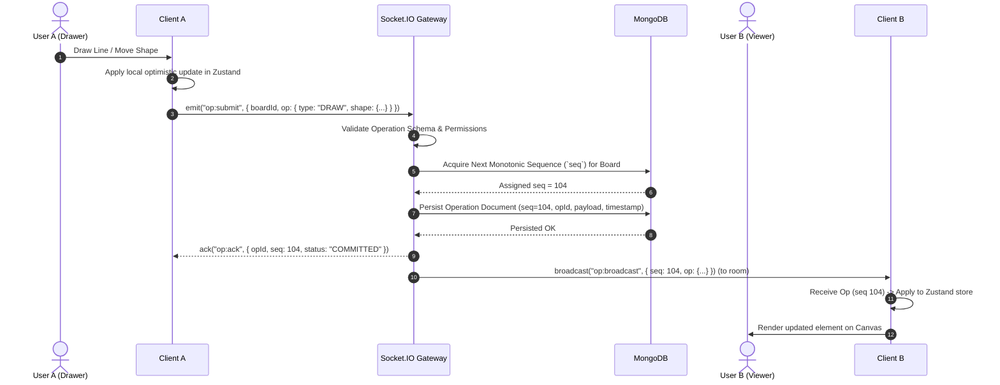
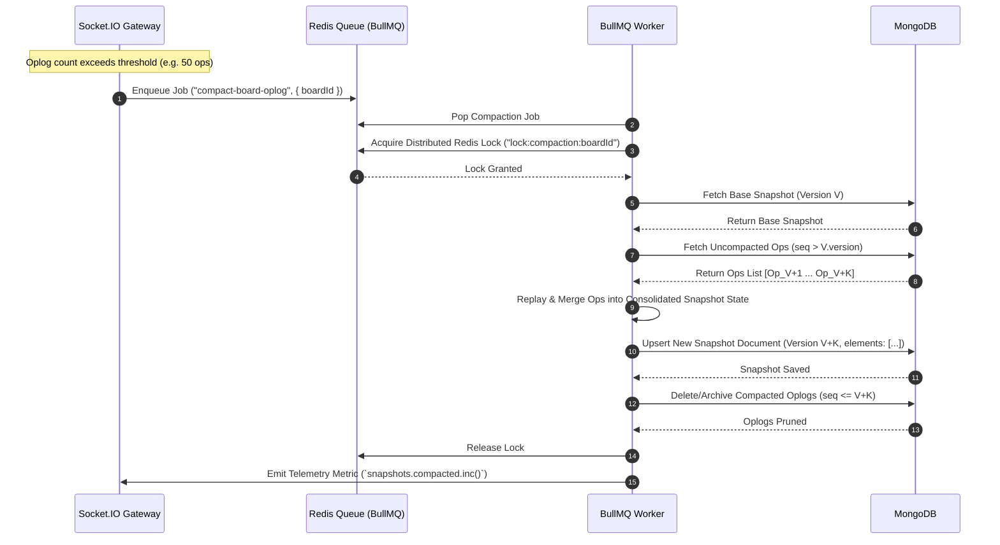

# System Architecture & Technical Specifications

This document outlines the system architecture, component interactions, sequence flows, and data model specs for the **Collaborative Whiteboard** application.

---

## 1. System Topology Overview

The system is structured as a modular TypeScript monorepo (`pnpm`) featuring an event-driven, authoritative server architecture with real-time websocket synchronization, distributed job queue compaction, and MongoDB document persistence.



---

## 2. Component Responsibilities

| Package                                                                            | Role                                                                                                               | Key Technologies                                  |
| :--------------------------------------------------------------------------------- | :----------------------------------------------------------------------------------------------------------------- | :------------------------------------------------ |
| [`packages/client`](file:///d:/collaborative-whiteboard/packages/client)           | Web UI, interactive canvas engine, local optimistic state, undo/redo history, export renderer.                     | React 18, Vite, Zustand, HTML5 Canvas API         |
| [`packages/socket`](file:///d:/collaborative-whiteboard/packages/socket)           | Scoped board room gateway, sequence number (`seq`) assignment, presence cursor tracking, op validation, broadcast. | Socket.IO, `@socket.io/redis-adapter`, Pino, OTel |
| [`packages/api`](file:///d:/collaborative-whiteboard/packages/api)                 | Authentication (JWT), board CRUD endpoints, direct REST oplog appends, snapshot REST endpoints.                    | Express, Mongoose, Zod, JWT                       |
| [`packages/worker`](file:///d:/collaborative-whiteboard/packages/worker)           | Async background worker executing background oplog compaction, snapshot pruning, and export generation.            | BullMQ, Redis, Mongoose                           |
| [`packages/shared`](file:///d:/collaborative-whiteboard/packages/shared)           | Shared TypeScript interfaces, operation schemas, canvas shape definitions, error codes.                            | TypeScript                                        |
| [`packages/infra-utils`](file:///d:/collaborative-whiteboard/packages/infra-utils) | Shared metrics utilities, Pino logging setup, OpenTelemetry exporter configuration.                                | Prometheus client, Pino, OpenTelemetry SDK        |

---

## 3. Sequence Flow Diagrams

### Sequence Flow 1: Board Join & State Hydration

When a client opens `/board/:id`, it authenticates via JWT, establishes a WebSocket connection with the Socket gateway, joins the specified board room, and hydrates its local canvas state.



---

### Sequence Flow 2: Operation Commit & Realtime Broadcast

When a user draws a shape or edits an element, the client updates locally immediately (optimistic UI) and emits an operation to the Socket gateway. The server validates the operation, assigns a monotonic sequence number `seq`, persists it to MongoDB, and broadcasts it to all other room members.



---

### Sequence Flow 3: Background Snapshot Persist & Compaction

To keep room join latencies fast ($O(\text{elements})$ instead of replaying thousands of historical ops), a background BullMQ worker periodically compacts accumulated oplog entries into a new unified board snapshot.



---

## 4. Data Schemas & Models

### Board Document (`boards`)

```json
{
  "_id": "60b8d5f3f9824c18f0ad562a",
  "title": "Architecture Blueprint",
  "ownerId": "user_123",
  "createdAt": "2026-08-13T10:00:00.000Z",
  "updatedAt": "2026-08-13T10:45:00.000Z"
}
```

### Operation Document (`oplogs`)

```json
{
  "_id": "op_987654321",
  "boardId": "60b8d5f3f9824c18f0ad562a",
  "seq": 104,
  "userId": "user_123",
  "type": "ELEMENT_UPDATE",
  "payload": {
    "elementId": "elem_rectangle_01",
    "changes": { "x": 250, "y": 320, "width": 180, "height": 90 }
  },
  "clientTimestamp": 1723545600000,
  "createdAt": "2026-08-13T10:45:01.120Z"
}
```

### Snapshot Document (`snapshots`)

```json
{
  "_id": "snap_104",
  "boardId": "60b8d5f3f9824c18f0ad562a",
  "version": 104,
  "elements": {
    "elem_rectangle_01": {
      "id": "elem_rectangle_01",
      "type": "rectangle",
      "x": 250,
      "y": 320,
      "width": 180,
      "height": 90,
      "strokeColor": "#3b82f6",
      "fillColor": "#eff6ff",
      "strokeWidth": 2,
      "updatedAt": 1723545600000
    }
  },
  "updatedAt": "2026-08-13T10:45:02.000Z"
}
```

---

## 5. Fault Tolerance & Reconnection Architecture

1. **Optimistic Local Execution**: The client instantly updates local Zustand state when drawing. If the network drops or server rejects the op, the client rolls back to the last confirmed server sequence state (`seq`).
2. **Monotonic Sequence Ordering (`seq`)**: The Socket server uses atomic incremental updates in MongoDB (`$inc`) to assign unique monotonic sequence numbers per board, guaranteeing global linear ordering.
3. **Automatic Reconnection & Gap Replay**: Upon WebSocket reconnection, the client sends its last known sequence number (`lastSeq`). The gateway fetches only missed operations (`seq > lastSeq`) and sends them in batch, preventing full page reloads.
4. **Worker Idempotency & Compaction Locks**: Snapshot compaction jobs use Redis key locks (`lock:compaction:<boardId>`) with TTLs to ensure only one worker node compacts a board at any given time.
