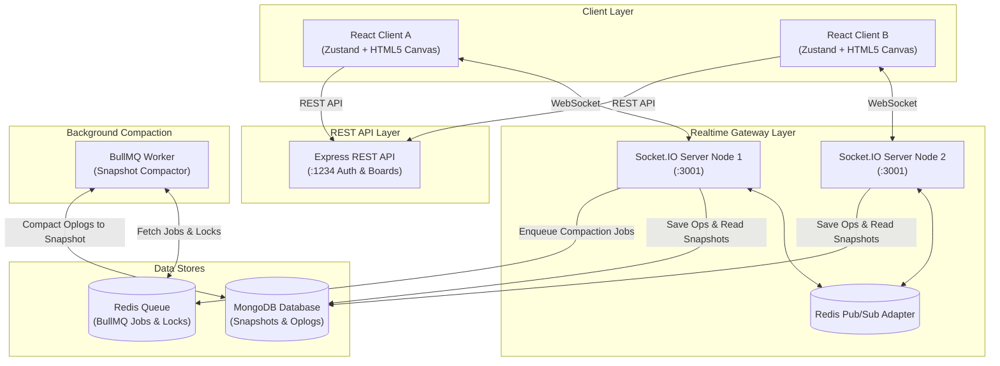

# Collaborative Whiteboard

[](https://www.typescriptlang.org/)
[](https://react.dev/)
[](https://socket.io/)
[](https://www.mongodb.com/)
[](https://redis.io/)
[](https://docs.bullmq.io/)
[](docs/testing-guide.md)

A high-performance, real-time collaborative whiteboard monorepo built with **React**, **TypeScript**, **Socket.IO**, **Express**, **BullMQ**, and **MongoDB**.

Features low-latency multi-user canvas drawing, real-time presence cursor tracking, optimistic UI updates, authoritative server sequence ordering (`seq`), out-of-band background snapshot compaction, and end-to-end telemetry instrumentation.

---

## 📸 Interactive Visual Overview

```text
+---------------------------------------------------------------------------------------+
|  COLLABORATIVE WHITEBOARD ENGINE v1.0                                                  |
+---------------------------------------------------------------------------------------+
|  [Select]  [Pan]  [Pen]  [Rectangle]  [Circle]  [Line]  [Text]  [Sticky]  [Eraser]    |
+---------------------------------------------------------------------------------------+
|                                                                                       |
|   +--------------------------+                         * (User B Cursor: "Alice")    |
|   |  Architecture Blueprint  |                                                       |
|   |  ----------------------  |             /-------------------------\                |
|   |  • Client (Zustand)      |            ( Real-time Sync Engine   )               |
|   |  • Socket Gateway (:3001)|             \-------------------------/                |
|   +--------------------------+                                                        |
|                 |                                                                     |
|                 v                                                                     |
|      [Sub-30ms Websocket Op] ----> (MongoDB Oplog) ----> [BullMQ Snapshot Compactor]  |
|                                                                                       |
+---------------------------------------------------------------------------------------+
```

---

## 🏛️ System Architecture

The system uses an **Authoritative Monotonic Server** architecture to guarantee zero client state divergence without the memory overhead of CRDT tombstones.



For complete sequence diagrams (Join, Op Commit, Persist) and component specs, see **[ARCHITECTURE.md](ARCHITECTURE.md)**.

---

## 🚀 Key Features & Implementation Status

| Feature / Component          | Status      | Tech Stack & Details                                                                                                                  |
| :--------------------------- | :---------- | :------------------------------------------------------------------------------------------------------------------------------------ |
| **Interactive Editor UI**    | Implemented | Pen, Rectangle, Circle, Line, Text, Sticky Notes, Eraser, Selection, Resize, Zoom/Pan, Undo/Redo, PNG Export.                         |
| **REST API Server**          | Implemented | JWT Signup/Login, Board CRUD, Snapshot endpoints, express validation via Zod schemas.                                                 |
| **Realtime Sync Gateway**    | Implemented | Socket.IO room gateway, monotonic sequence ordering (`seq`), op validation, presence cursor relay, reconnection replay.               |
| **Async Snapshot Compactor** | Implemented | BullMQ worker consuming compaction jobs, distributed Redis locking (`lock:compaction`), atomic snapshot consolidation, oplog pruning. |
| **Observability & Metrics**  | Implemented | Prometheus endpoints (`/metrics`), Grafana dashboard, Pino structured logging, OpenTelemetry tracing.                                 |
| **Automated Test Suite**     | Implemented | **72 passing integration tests** across `client`, `api`, `socket`, `worker`, `shared`, and `infra-utils`.                             |

---

## 💡 System Design Highlights & Tradeoffs

A detailed comparison of system design choices is documented in **[DESIGN_DOC.md](DESIGN_DOC.md)**:

1. **Why Authoritative Monotonic Server over CRDTs?**
   - Canvas shapes are discrete 2D spatial objects. Attribute-level Last-Write-Wins (LWW) with server sequence numbers (`seq`) achieves identical visual consistency with a fraction of CRDT tombstone memory overhead and zero state vector complexity.
2. **Snapshot Compaction & Hydration Performance**
   - Cold-starting a board room load takes $<50\text{ms}$ by loading a consolidated **Base Snapshot** + only recent uncompacted oplogs, reducing network payload from $O(\text{total history ops})$ to $O(\text{active elements})$.
3. **Horizontal Scalability Path**
   - Multi-instance Socket gateway nodes scale seamlessly using `@socket.io/redis-adapter` pub/sub and distributed Redis locks.

---

## 🛠️ Quick Start & Local Setup

### Prerequisites

- **Node.js**: v20.0+
- **pnpm**: v9.0+
- **Docker & Docker Compose**: (Optional, for local MongoDB & Redis containers)

### 1. Installation

Clone the repository and install workspace dependencies:

```bash
git clone https://github.com/haresahani/collaborative-whiteboard.git
cd collaborative-whiteboard
pnpm install
```

### 2. Environment Setup

Copy the environment template:

```bash
cp env/.env.example env/dev.env
```

### 3. Start Infrastructure Services (MongoDB & Redis)

Using Docker Compose:

```bash
docker compose -f infra/docker-compose.yml up -d
```

_(Or ensure local instances of MongoDB on `27017` and Redis on `6379` are active)_.

### 4. Launch Monorepo Services

Run all services concurrently using the root dev command:

```bash
pnpm dev
```

Or start targeted packages individually:

```bash
pnpm --filter client dev   # React client at http://localhost:5173
pnpm --filter api dev      # Express API at http://localhost:1234
pnpm --filter socket dev   # Socket gateway at ws://localhost:3001
pnpm --filter worker dev   # BullMQ background worker
```

---

## 🧪 Quality & Test Execution

The repo maintains a clean baseline with **72 passing automated integration tests**:

```bash
# Run all workspace tests
pnpm test

# Run TypeScript typechecks
pnpm typecheck

# Run linter
pnpm lint

# Run production build
pnpm build
```

---

## 🎥 Live Interview Demo Walkthrough

A complete timed 2–3 minute video presentation script and live interview walkthrough guide is available in **[docs/DEMO_SCRIPT.md](docs/DEMO_SCRIPT.md)**.

### Quick 2-User Local Test Procedure

1. Start services (`pnpm dev`).
2. Open Window 1: `http://localhost:5173/board/demo-board`
3. Open Window 2 (Incognito): `http://localhost:5173/board/demo-board`
4. Draw a shape in Window 1 -> verify instant sub-30ms propagation in Window 2.
5. Move cursor in Window 1 -> verify live presence indicator pill in Window 2.

---

## 📁 Repository Structure

```text
collaborative-whiteboard/
├── ARCHITECTURE.md            # Main architecture document with sequence diagrams
├── DESIGN_DOC.md              # 1-Page System Design Doc (CRDT vs OT, Compaction)
├── README.md                  # Project overview, setup, and demo guide
├── docs/                      # Engineering docs, runbooks, and demo script
│   ├── DEMO_SCRIPT.md         # Timed 2-3 min video presentation script
│   ├── INTERVIEW_NOTES.md     # Technical interview narrative and talking points
│   ├── OBSERVABILITY.md       # Prometheus, Grafana, Pino, OpenTelemetry setup
│   └── runbook.md             # Operations & setup runbook
├── infra/                     # Docker Compose and Grafana dashboard configs
└── packages/
    ├── api/                   # Express REST API (Auth, Board CRUD, Snapshots)
    ├── client/                # React 18 + Zustand + HTML5 Canvas Editor
    ├── socket/                # Socket.IO Gateway (Rooms, Monotonic Seq, Presence)
    ├── worker/                # BullMQ Background Worker (Oplog Snapshot Compaction)
    ├── shared/                # Shared domain types, contracts, Zod schemas
    └── infra-utils/           # Metrics, logging, and OpenTelemetry instrumentation
```

---

## 📄 License

[MIT](LICENSE) © Collaborative Whiteboard Team
